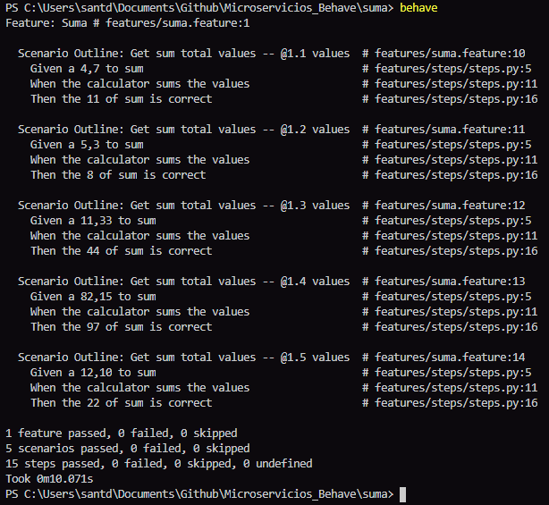
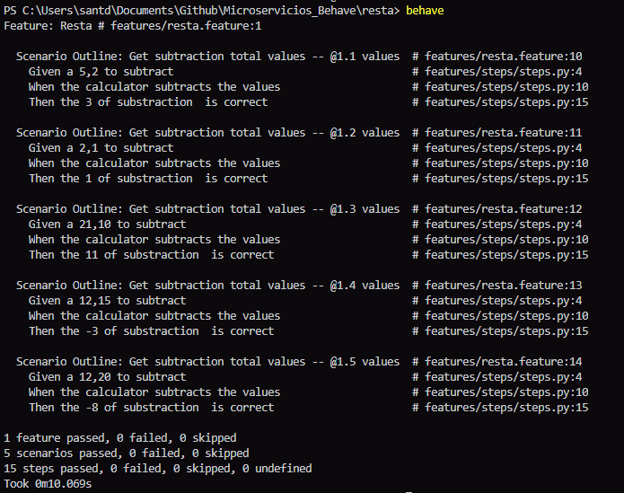
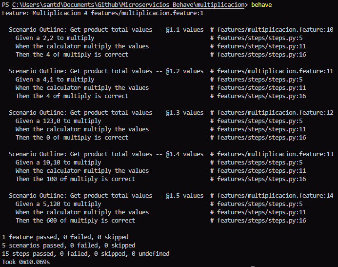
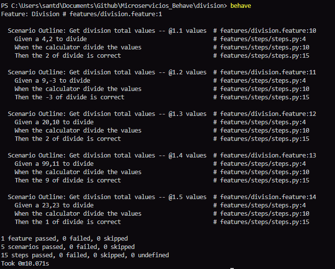
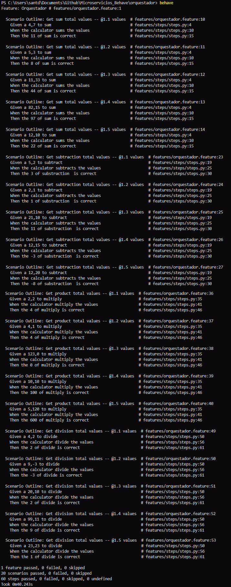

# MicroserviciosConBehave

Ejercicio de entorno de pruebas de comportamiento a microservicios.
La aplicación de microservicios está realizada en FLASK y el entorno de prueba se ejecuta utilizando el entorno de pruebas de la librería de python behave.
## Integrantes

- Cristian Felipe Patiño Cáceres - 20141020079
- Cristian David Santoyo Parra - 20141020077
- Brian Giovanny Alfonso Rodriguez - 20151020600
- Catalina Hernandez Casas - 20201099034

## Pruebas para las distintas operaciones

* Prueba y resultados para la operación suma:

        

    
* Prueba y resultados para la operación resta:
 

        

   
* Prueba y resultados para la operación multiplicación:

        

* Prueba y resultados para la operación división:

        

** Prueba para el orquestador, agrupando todos los microservicios

    

